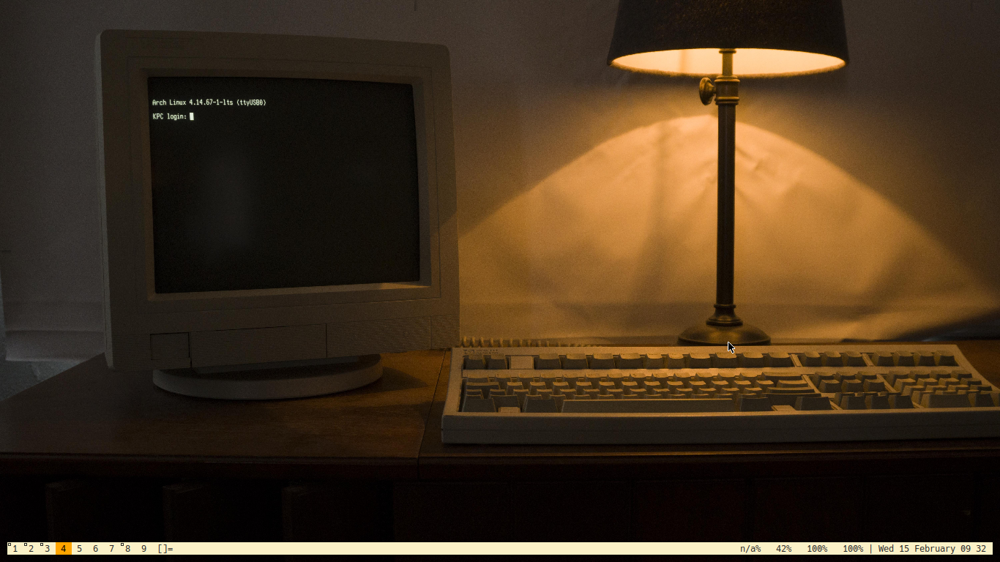

# CONFIGURACIÓN PERSONAL GENTOO THINKPAD T420

En este repositorio se encuentran algunas configuraciones personales de
cómo he preferido utilizar gentoo en mi equipo.

La mayoría de dichas configuraciones se encuentran dentro de la
carpeta *".config"*, pero las configuraciones respecto de portage se
encuentran en la carpeta *"portage"*.

Respecto del escritorio propiamente tal, utilizo *DWM* y *Dmenu* con pequeñas
modificaciones que me han sido suficientes para mi uso cotidiano.

- [Repositorio Personal DWM](https://github.com/leandrusfanzec/dwm-leandrus)
- [Repositorio Personal Dmenu](https://github.com/leandrusfanzec/dmenu-leandrus)
